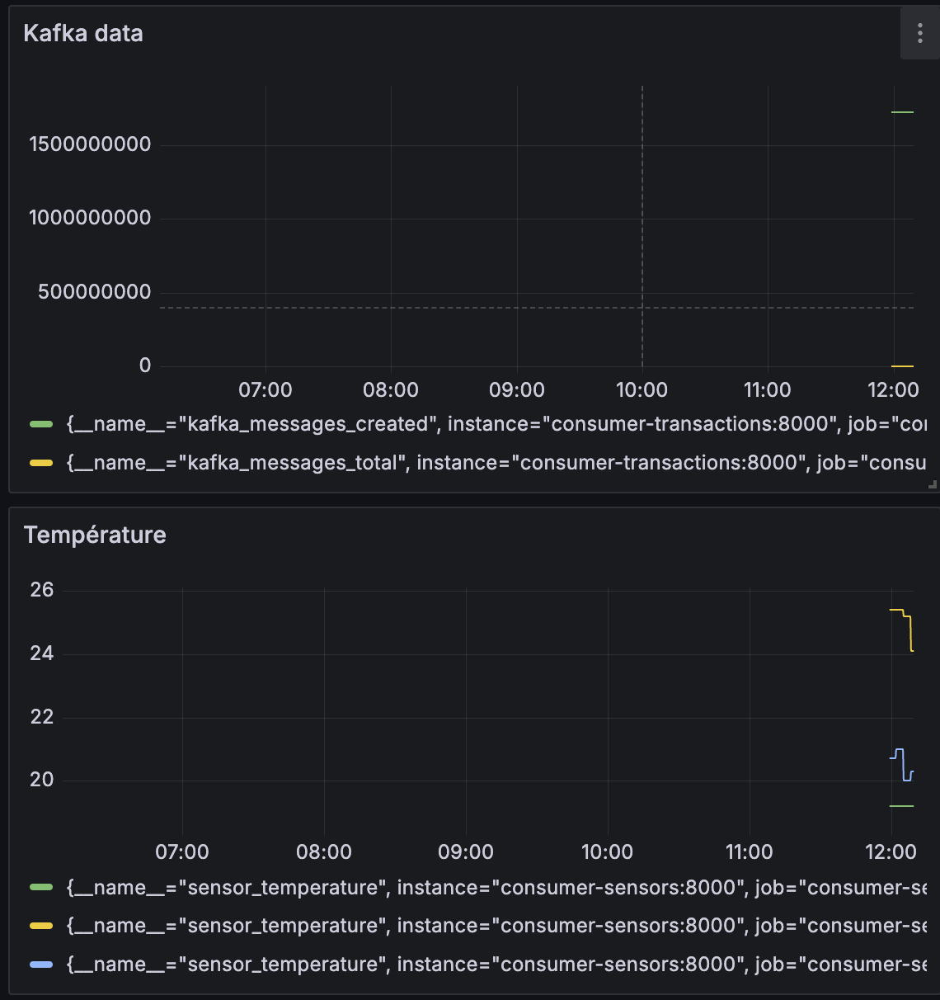

Groupe : DERENSY Dany et GRANIER Antoine

# Lancement :

- sudo docker-compose up -d

# Producers :

- logs
- transactions
- temperature (API http://api.weatherapi.com)

# Consumer :

- logs (Kafka Consumer et Ajout dans MongoDB)
- transactions (Kafka Consumer et Ajout dans MongoDB)
- temperature (Spark, moyenne sur les temperatures de plusieurs villes)

# Dashboard :

- dashboard sur les données kafka traités et sur les temperatures

## Accéder à grafana :

- localhost:3000
- user : admin
- mot de passe : admin
